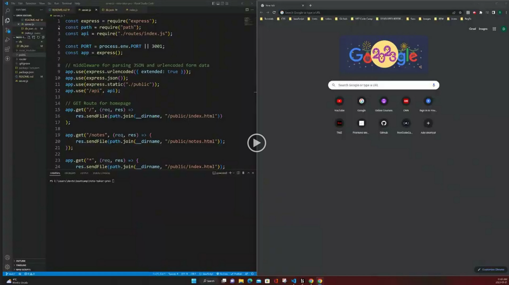
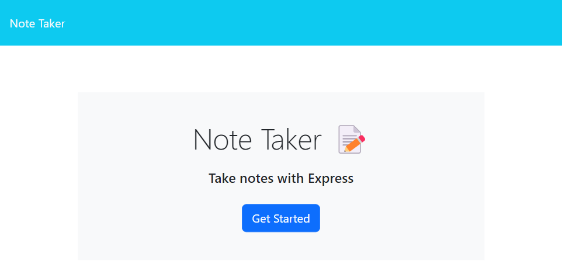
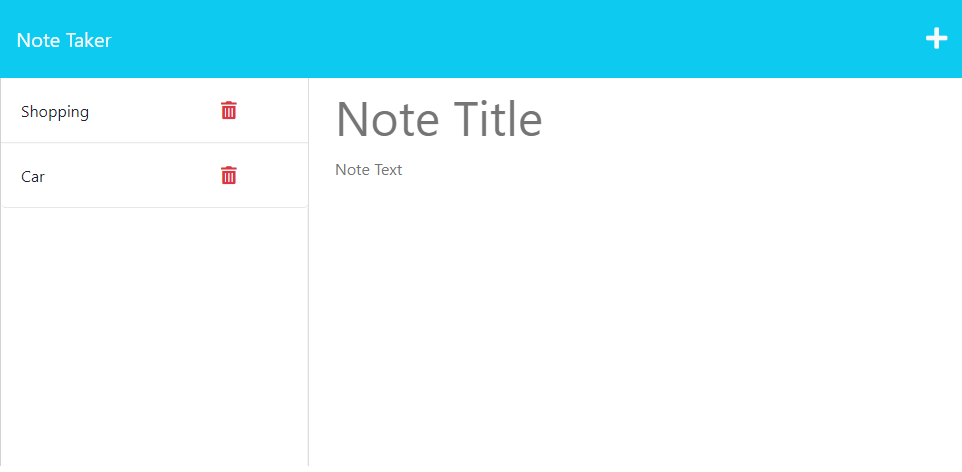

# Note Taker Pro

## Description

The motivation for this project was to create an application to write, save and delete notes using node and express fs module. The application’s front end was provided. my job as a full stack developer was to build the back end, connect the two, and then deploy the entire application to Heroku. The following HTML routes was created:

-   GET `/notes` - returns the `notes.html` file.
-   GET `*` - return the `index.html` file.

The following API routes were created:

-   GET `/api/notes` - reads `db.json` file and return all saved notes as JSON.

-   POST `/api/notes` - receives a new note to save on the request body, adding it to the `db.json` file, and returns the new note to the client.
-   DELETE `/api/notes/:id` - receives a query parameter containing the id of a note to delete from the `db.json` file.

## Walkthrough Video

## Screenshot

